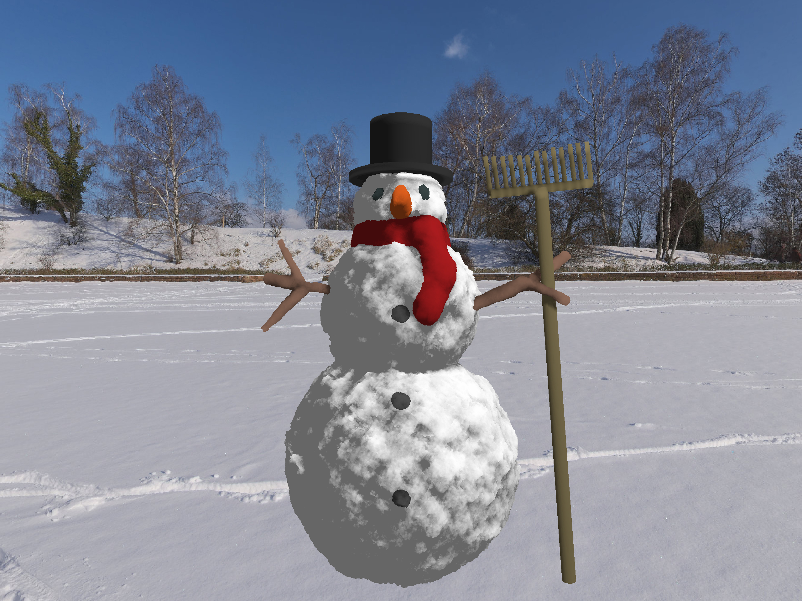

# fst_m1_rdv_snowman
Projet forké depuis [ssloy/tinykaboom](https://github.com/ssloy/tinykaboom), de Monsieur Sokolov.

## Travail demandé
Dans le cadre du cours de *Représentation des Données Visuelles* à la Faculté des Sciences et Technologies
de l'Université de Lorraine, dispensé par Monsieur Sokolov, nous devons réaliser un bonhomme de neige avant la
fin de l'hiver 2024.

## Licence
Ce projet est sous licence [CeCILL-B](https://cecill.info/licences/Licence_CeCILL-B_V1-fr.html).

Nous vous invitons à consulter le fichier [LICENSE](./LICENSE) pour plus d'informations sur la licence de ce projet.

## Auteurs
* [Antoine Contoux](https://github.com/ActxLeToucan)
* [Guillaume Renard](https://github.com/dranerine)
### Code tiers
* [Dmitry V. Sokolov](https://github.com/ssloy)
  * [tinykaboom](https://github.com/ssloy/tinykaboom), sous license [WTFPL](https://spdx.org/licenses/WTFPL), projet original
  * [tinyraytracer](https://github.com/ssloy/tinyraytracer), sous license [WTFPL](https://spdx.org/licenses/WTFPL),
  pour le code permettant de charger et d'écrire des images avec la bibliothèque [stb](https://github.com/nothings/stb)
* [Inigo Quilez](https://iquilezles.org/), auteur de la fonction du calcul de distance à un cylindre, sous license [MIT](https://spdx.org/licenses/MIT)
### Bibliothèques
* [stb](https://github.com/nothings/stb), sous license [MIT](https://spdx.org/licenses/MIT)
### Images
* [Andreas Mischok](https://polyhaven.com/all?a=Andreas%20Mischok), pour l'[envmap *Snowy Field*](./envmap.jpg), sous license [CC0](https://spdx.org/licenses/CC0-1.0)

## Compilation
```sh
git clone https://github.com/ActxLeToucan/fst_m1_rdv_snowman.git
cd fst_m1_rdv_snowman
mkdir build
cd build
cmake ..  
make
```

## Utilisation
```sh
./fst_m1_rdv_snowman [factor] [-v]
```
* `factor` : flottant, facteur sur les dimensions de l'image (par défaut 1.0). Permet de générer une image plus petite
(et donc plus rapidement) par exemple lors du développement, ou plus grande pour une image finale.
* `-v` : optionnel, active l'affichage de la progression du rendu (recommandé pour les images de grande taille).

### Astuce pour les utilisateurs de Windows
Si vous utilisez Windows et que tous les processeurs logiques de votre machine ne sont pas utilisés, vous pouvez
vous rendre dans le gestionnaire des tâches, onglet *Détails*, clic droit sur le processus `fst_m1_rdv_snowman.exe`,
puis *Définir l'affinité*, et cocher tous les processeurs logiques disponibles.

## Résultat

Voici le résultat de notre travail. Le rendu ci-dessus a été généré avec un facteur de 4.0.

Nous avons choisit de bruiter la plupart de nos formes pour donner un aspect plus naturel à notre bonhomme de neige.
Nous espérons que vous apprécierez le résultat.

### Performances
On nous a donné une limite de 1h de rendu (sans préciser la taille de l'image).

Avec les résultats suivants, nous pouvons estimer que nous sommes en mesure de générer une image avec la taille
par défaut (640x480) dans le temps imparti sur la plupart des machines.

#### Facteur 1.0 (par défaut)
| Nom             | Cœurs | Threads | Fréquence de base | Temps de rendu |
|-----------------|-------|---------|-------------------|----------------|
| Intel i5-10600K | 6     | 12      | 4.10 GHz          | 40 s           |
| Intel i5-1240P  | 12    | 16      | 1.70 GHz          | 20 s           |
| Ryzen 7 7737U   | 8     | 16      | 2.70 GHz          | 18 s           |

#### Facteur 4.0
| Nom             | Cœurs | Threads | Fréquence de base | Temps de rendu |
|-----------------|-------|---------|-------------------|----------------|
| Intel i5-10600K | 6     | 12      | 4.10 GHz          | 10 min         |
| Intel i5-1240P  | 12    | 16      | 1.70 GHz          | 6 min          |
| Ryzen 7 7737U   | 8     | 16      | 2.70 GHz          | 5 min          |
